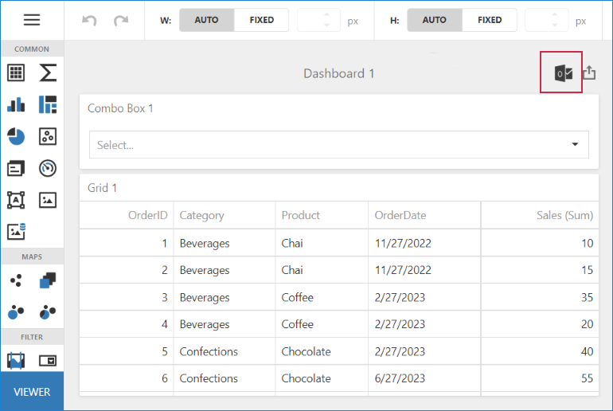

<!-- default badges list -->

<!-- default badges end -->
# Dashboard for ASP.NET Core - How to send an email with the exported Dashboard document using MailKit

This example demonstrates how to email an exported Dashboard document (PDF in this example) with the [MailKit](https://github.com/jstedfast/MailKit) cross-platform mail client library. In this example, we handle the [ViewerApiExtension.onDashboardTitleToolbarUpdated](https://docs.devexpress.com/Dashboard/js-DevExpress.Dashboard.ViewerApiExtensionOptions#js_devexpress_dashboard_viewerapiextensionoptions_ondashboardtitletoolbarupdated) event to add a custom **Email** button to the [Dashboard Title](https://docs.devexpress.com/Dashboard/117383/web-dashboard/ui-elements-and-customization/ui-elements/dashboard-title). Once the end-user clicks on the button, we send an **$.ajax** POST request to the server using the technique from the following code example to pass the dashboard's ID and [State](https://docs.devexpress.com/Dashboard/119997/web-dashboard/aspnet-core-dashboard-control/manage-dashboard-state) from the client side to the server: [Dashboard for MVC - How to implement server-side export](https://github.com/DevExpress-Examples/asp-net-mvc-dashboard-implement-server-side-export).

On the server side, we accept the callback and its parameters in the **IndexModel.OnPostEmail** method. There we use the [DashboardExporter](https://docs.devexpress.com/Dashboard/DevExpress.DashboardCommon.DashboardExporter) class instance to export a corresponding  dashboard to a PDF document and send it as an attachment along with the **MimeMessage** object from the [MailKit](https://github.com/jstedfast/MailKit) library.

Note that we use a fake [Ethereal Email](https://ethereal.email/) SMTP server to test this operation. You can replace the authentication parameters passed to the **SmtpClient.Connect** and **SmtpClient.Authenticate** methods with parameters that correspond to your email server.

The resulting dashboard looks as follows:

## Files to Look at

* [DashboardConfig.cs](./CS/Program.cs)
* [Index.cshtml](./CS/Pages/Index.cshtml)
* [Index.cshtml.cs](./CS/Pages/Index.cshtml.cs)

## Documentation

- [DashboardExporter](https://docs.devexpress.com/Dashboard/DevExpress.DashboardCommon.DashboardExporter)
- [Dashboard Title](https://docs.devexpress.com/Dashboard/117383/web-dashboard/ui-elements-and-customization/ui-elements/dashboard-title)
- [Manage Dashboard State in ASP.NET Core Applications](https://docs.devexpress.com/Dashboard/119997/web-dashboard/aspnet-core-dashboard-control/manage-dashboard-state)

## More Examples

- [Dashboard for MVC - How to implement server-side export](https://github.com/DevExpress-Examples/asp-net-mvc-dashboard-implement-server-side-export)
- [BI Dashboard - How to Use MailKit to Send a Dashboard as a Document in PDF](https://github.com/DevExpress-Examples/bi-dashboard-mailkit-export)
- [BI Dashboard - How to Email a Dashboard that Displays Different Data Depending on the Addressee](https://github.com/DevExpress-Examples/bi-dashboard-mailkit-export-console-app)
